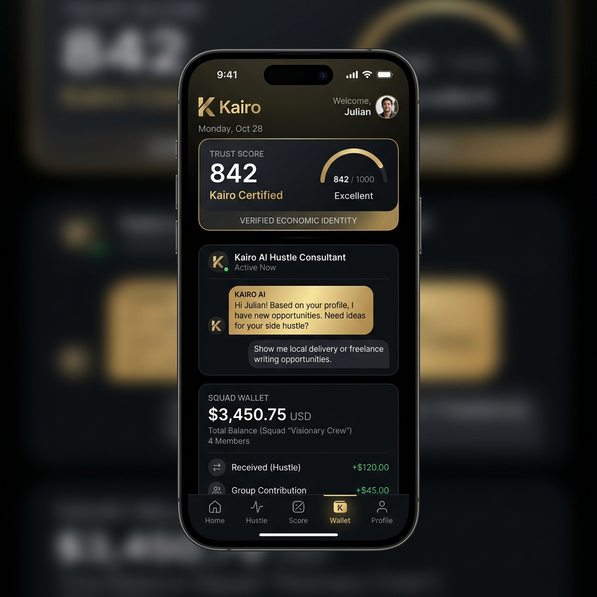

# KAIRO — The AI Economic Identity Network 🌍✨



**Kairo** is an AI-powered economic identity platform designed to bring the informal economy into the formal financial system. Built for the **Squad Hackathon 3.0**, Kairo enables "hustlers"—artisans, traders, and gig workers—to build a verifiable financial reputation (Trust Score) and access professional banking services via the **Squad API**.

---

## 🚀 The Problem & Solution

In emerging markets like Nigeria, millions of workers have high skills but no formal "Economic Identity." Without a credit history or verifiable income, they are locked out of loans and global opportunities.

**Kairo solves this by:**
1.  **Verifying the "Hustle"**: Using AI to analyze work samples, voice stories, and transaction data.
2.  **Building Trust**: A dynamic **Trust Score** that grows as you transact and verify your skills.
3.  **Financial Inclusion**: A full **Squad-backed wallet** for payments, savings, and micro-loans.

---

## 🛠 Core Features

### 🤖 AI Hustle Consultant
- **Voice Briefing**: The AI greets you upon login with a verbal summary of the market.
- **Smart Matching**: AI analyzes your skills and Trust Score to find top-tier job matches.
- **Direct Pitch**: Connect directly with verified employers and attach your Kairo credentials.

### 🛡 Trust Score (The Kairo ID)
- A proprietary scoring algorithm that looks at BVN verification, transaction history, and "Proof of Work" (photos/voice stories).
- Unlocks higher loan limits and "Elite" employer connections.

### 💳 Squad-Integrated Wallet
- **Virtual Accounts**: Instant account generation for receiving payments.
- **Micro-Loans**: Access credit based on your Trust Score.
- **Savings Goals**: Plan for your next equipment purchase or workshop.

### 🗺 Economic Heatmap
- Visualizes market demand across Lagos and beyond.
- Helps workers move to high-demand areas to maximize daily earnings.

---

## 🧰 Tech Stack

- **Framework**: Expo / React Native (Universal App)
- **Styling**: Premium Obsidian & Metallic Gold Design System
- **Animations**: React Native Reanimated (High-Fidelity Transitions)
- **Payments**: Squad API (Virtual Accounts, Transfers)
- **AI/Voice**: Expo Speech (TTS) & Custom Logic Hooks
- **Media**: Expo Image Picker (Proof of Work verification)

---

## 🏃‍♂️ Getting Started

### Prerequisites
- Node.js (v18+)
- Expo Go app on your Android/iOS device

### Installation
1.  Clone the repository:
    ```bash
    git clone https://github.com/oredonut/kairo.git
    cd kairo
    ```
2.  Install dependencies:
    ```bash
    npm install
    ```
3.  Start the development server:
    ```bash
    npx expo start
    ```

---

## 📦 Deployment

Kairo is optimized for **EAS (Expo Application Services)**.

- **Android Preview**: [Download the latest APK/AAB](https://expo.dev/accounts/odebs/projects/kairo/builds/febdfe7d-1cd2-4739-a3a1-140ee2f79af7)
- **Update Channel**: `preview`

---

## 🤝 The Team

Developed with ❤️ for the **Squad Hackathon 3.0**.

**Vision**: To empower the next billion workers with a digital economic identity that the world can trust.

---

*© 2026 Kairo Network. All Rights Reserved.*
